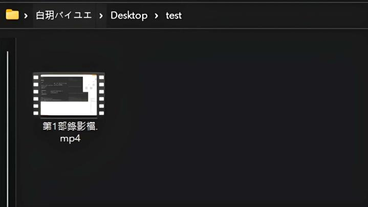
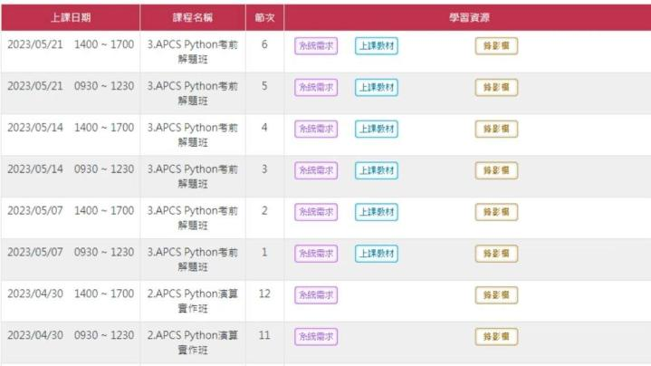
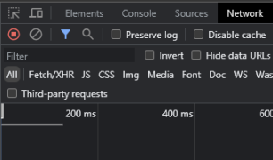
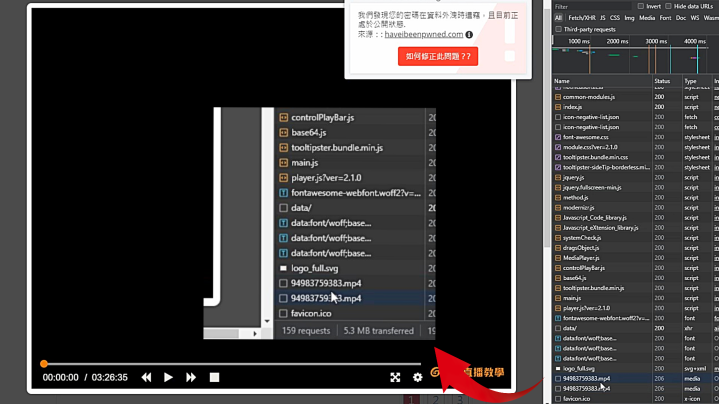
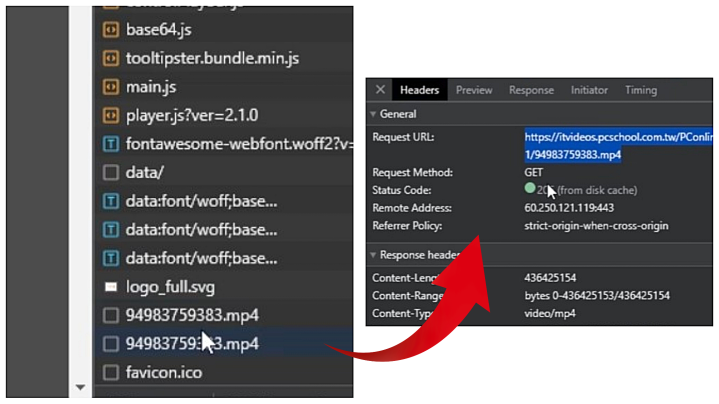

# 巨匠錄影檔下載工具

這個程式是一個簡單的Python工具，可以幫助你下載巨匠直播的錄影檔。它支援單一影片下載和多個影片批量下載，並且透過進度條顯示下載進度，讓你更方便地獲取你需要的錄影檔。

## 功能簡介

1. 使用者輸入資料夾名稱：
    - 會要求使用者輸入一個資料夾名稱，此資料夾用來儲存下載的影片。

2. 創建儲存資料夾：
    - 程式會試圖在桌面上創建指定名稱的資料夾，以保存下載的影片。
    - 如果資料夾名稱重複，程式會顯示錯誤訊息並終止。

3. 選擇下載模式：
    - 單一影片下載模式：
        - 如果使用者選擇下載單一影片，程式會開始輸入影片連結並下載。
        - 程式會自動檢測影片的名稱以防止覆蓋已存在的影片。
        - 程式會向使用者請求輸入巨匠直播錄影檔的連結。
        - 程式使用 `requests` 庫來發送 GET 請求以獲取影片內容，並使用 `tqdm` 顯示下載進度條。

    - 多個影片下載模式：
        - 如果使用者選擇下載多個影片，程式會詢問要下載多少部影片。
        - 程式會檢查已在資料夾中存在的影片數量，以確保下載的影片名稱不會重複。
        - 使用者需要依次輸入每部影片的連結。
        - 像在單一影片下載模式中一樣，程式會使用 `requests` 和 `tqdm` 來處理下載和進度顯示。

4. 錯誤處理：
    - 如果網頁響應的狀態碼不是 200，程式會顯示錯誤訊息。

## 範例演示




## 執行要求

- Python 3.x 版本
- requests 庫
- tqdm 庫

## 安裝步驟

1. 使用 `git clone` 命令或下載 ZIP 壓縮檔，將程式複製到您的電腦中。

2. 打開終端機或命令提示字元，進入程式所在的資料夾。

3. 執行以下指令，安裝必要的套件：
    ```
    pip install requests
    ```

    ```
    pip install tqdm
    ```

4. 執行以下指令，以執行程式：
    ```
    python pcschool.py
    ```

## 如何獲取巨匠錄影檔連結：

1. 開啟您的網頁瀏覽器，前往[巨匠直播教學官網](https://www.pcschoolonline.com.tw/)。

    

2. 在網站上使用您的登入帳號和密碼進行登入，確保您已成功登入您的帳號。

    

3. 點擊網站上的「`課程檔案下載`」選項。

    

4. 從可用的下載選項中選擇要下載的「`錄影檔`」。

    

5. 在選擇好下載項目後，暫時不要開始播放影片。請按下鍵盤上的`「F12`」按鍵，選擇「`Network`」（網路）選項，然後再選擇「`All`」（全部）。

    

6. 接下來，請開始播放影片，但隨即暫停播放。在網路選項卡中，您將看到一些檔案，其標題會以「`.mp4`」結尾。這些就是您要下載的影片檔案。

    

7. 雙擊後，選擇「`headers`」（標頭）選項。在詳細資訊中，您將看到「`General`」（一般）區塊。點擊該區塊以擴展它，您將看到「`Request URL`」（請求網址）。這個網址就是原始影片的位置。請將此網址複製以備使用。

    

8. 如需下載多個錄影檔，請重複上述步驟，為每個欲下載的影片獲取相應的網址。

## 為甚麼會需要透過原始碼獲取影片連結

當我們想下載影片時，可能會遇到一些困難，影片的網址不見得會直接顯示在瀏覽器的網址欄中，而是被隱藏或加密了。這就是為什麼我們需要這個教學的原因，讓我們來探索一下為何我們需要這個教學。

假設你在找到了一個很棒的影片，你可能會想直接複製影片的網址並開始下載。然而事實並不是如此簡單。有些網站出於保護版權或其他原因，不會將影片的實際網址公開展示。相反的；可能會使用一些技術來隱藏或加密網址，以防止未經授權的下載。

### 網站保護版權的需求

許多網站出於版權保護或其他合法考量，不希望未經授權的用戶能夠輕易地下載其影片。為了達到這個目標，可能會運用各種技術手段，將影片網址隱藏或進行加密，防止被一般用戶所識別或直接獲取。

### 透過原始碼獲取連結

那麼我們該如何解決這個問題呢？我們需要一些額外的步驟來獲取影片的真實網址，以便我們可以成功下載。以下是我們可能會需要採取的步驟：

1. **登入驗證**：有些網站可能要求你登入帳戶才能訪問影片頁面。這是一個驗證步驟，確保只有授權的使用者可以訪問影片。

2. **分析網頁**：有時影片的實際網址可能被埋藏在網頁的原始碼中。我們需要仔細檢查網頁的元素，找到與影片相關的信息，以便我們可以獲取真正的網址。

3. **監控網絡請求**：在播放影片時，瀏覽器會向伺服器發送請求，以獲取影片數據。我們可以通過監控網絡請求，捕獲到影片的真實網址。

4. **HTTP 標頭**：每次向伺服器發送請求時，我們的瀏覽器都會附帶一些標頭信息。這些標頭可能包含了影片的真實網址，我們可以從中獲取我們需要的訊息。

透過深入了解網頁的原始碼和監控網絡活動，成功地獲取影片的真實連結，以便順利進行下載。

## 如何使用

1. 首先，確保你已經完成安裝步驟，並準備好執行程式。

2. 執行程式檔案 `pcschool.py`。

3. 開始下載錄影檔：

    - 單一影片模式：
        - 跟隨程式提示，依次輸入要下載的巨匠錄影檔連結。
        - 程式會自動為每個影片編號並下載到預設的資料夾中。

    - 多個影片模式：
        - 跟隨程式提示，輸入要下載的總影片數量。
        - 接著依次輸入每個影片的連結。
        - 程式會自動編號並下載到預設的資料夾中。

4. 下載進度監控：

    - 在下載過程中，終端機會顯示進度條，讓你隨時了解下載進度。

5. 自訂存儲路徑：

    - 如果你想將下載的錄影檔存儲在其他位置，你可以修改以下程式碼中的路徑：
    
        ```py
        desktop_path = os.path.expanduser(r"~\Desktop")
        ```
    
        將 `"~\Desktop"` 路徑修改為你想要的資料夾路徑即可。

## 注意事項：

1. **可能出現的安全警告**：當你執行程式時，有可能會看到像以下這樣的不安全警告訊息：

    ```py
    InsecureRequestWarning: Unverified HTTPS request is being made to host 'itvideos.pcschool.com.tw'. Adding certificate verification is strongly advised. See: https://urllib3.readthedocs.io/en/latest/advanced-usage.html#tls-warnings
    warnings.warn(
    ```

    這訊息是因為程式正嘗試進行不安全的 HTTPS 請求，通常是因為網站的 SSL 憑證未經驗證。如果你信任該網站，你可以忽略這警告。

2.  **停用警告訊息**：如果你不想在程式執行時看到這些錯誤警告，你可以取消以下程式碼的註解，以停用不安全請求的警告訊息：

    ```py
    # 禁用不安全請求警告
    # requests.packages.urllib3.disable_warnings()
    ```

3.  **未驗證的 HTTPS 請求**：在程式中使用 `verify=False` 參數意味著你正在進行未驗證的 HTTPS 請求。這可能帶來安全風險，在這種情況下，我們無法確保傳輸的資料是否受到保護。如果您不放心請先暫停你身邊下載的工作。

## 授權資訊

這個程式遵循 [MIT 授權](LICENSE.txt)，您可以自由使用、修改和分享這個程式。